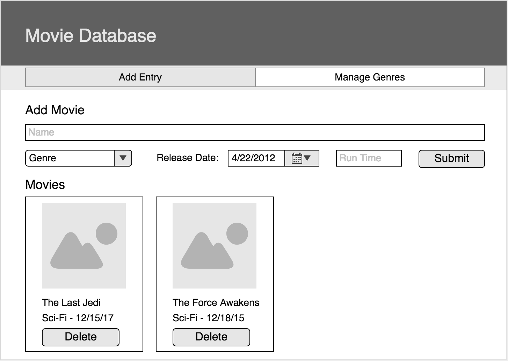
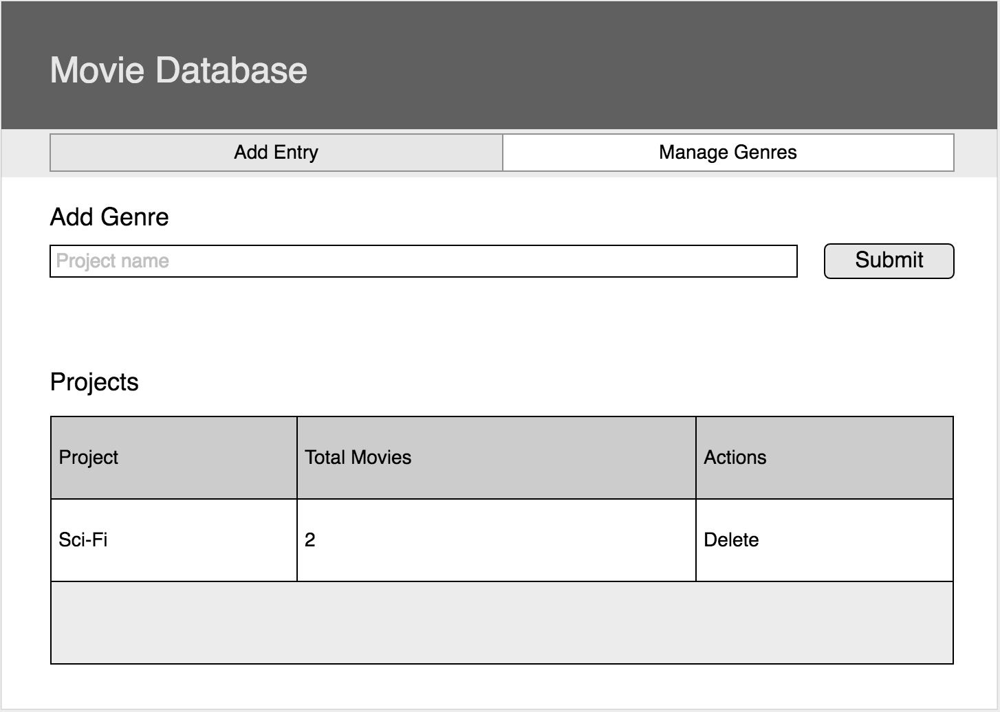

# Movie Collection Project

> NOTE: Do not fork this repository. Instead, create your own repository from scratch.

Trello Board: https://trello.com/b/W1vv7aFe/movie-collection-weekend-project

## Features

- Add genres
- Add movies by name, absolute image URL, release date, genere and run time
- Remove movies
- Delete existing entries
- Show total number of movies next to each genre

### Wireframes

#### Add Movie View

#### Manage Genres View

### Database

Start with two tables **movies** & **genres**. When base features are complete, add more tables as needed for stretch goals.

## Stretch Goals

- Angular Material for design
- Ability to edit genres or movies
- Ability to search or filter by name or genre
- Vote up or down a movie
- Ability to favorite a movie and display favorites on a separate route
- Feel free to deviate from this list and add features of your own

## Variations

The following variations are available for this project. Instead of **movies**, you could implement the project with **books** or **songs**. Your database for base mode should still just be two tables.

- Movies -> Books and Genre -> Author
- Movies -> Songs and Genre -> Artist

## CREATE TABLE QUERIES

CREATE TABLE "movies" (
    "id" serial primary key,
    "title" varchar(40) not null,
    "genre_id" REFERENCES genres ON DELETE CASCADE,
    "release" integer,
    "time" integer,
    "media" varchar(200) DEFAULT 'https://image.freepik.com/free-icon/film-role-ios-7-interface-symbol_318-34835.jpg'
);

CREATE TABLE "genres" (
    "id" serial primary key,
    "name" varchar(40) not null,
);

"movie_id" integer REFERENCES movies ON DELETE CASCADE